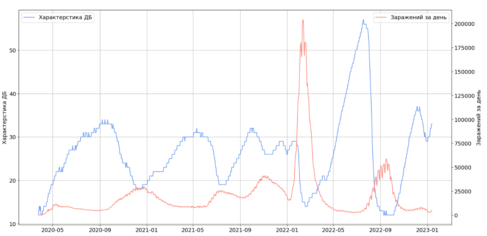
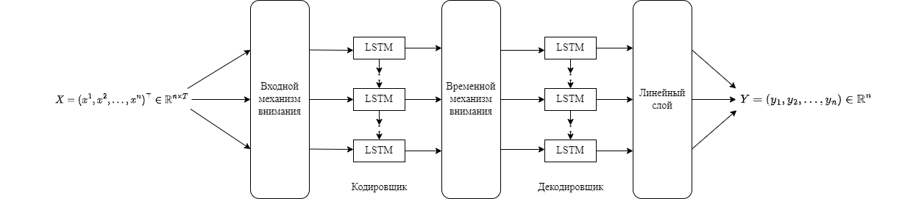
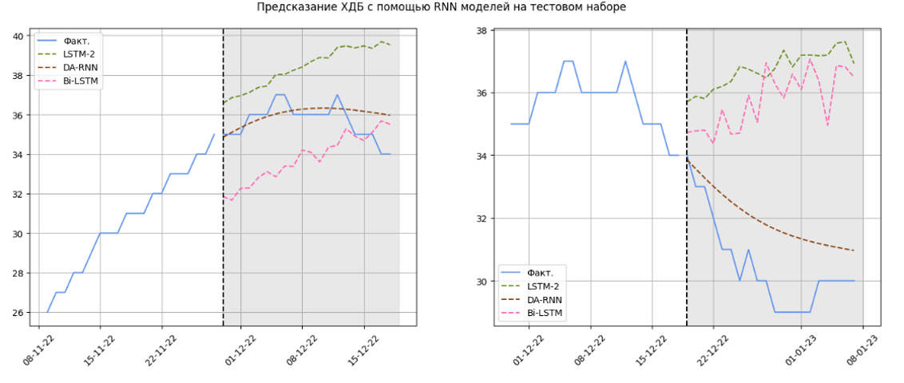

В работе исследуется зависимость характеристики 
динамического баланса, введенной в [балансовой модели CIR](https://www.researchgate.net/publication/355017277_Balance_Model_of_COVID-19_Epidemic_Based_on_Percentage_Growth_RateBalansovaa_model_epidemii_COVID-19_na_osnove_procentnogo_prirosta), 
от параметров распространения COVID-19. Ниже представлена динамика ХДБ (синяя кривая) 
и кол-во заражений за день (красная кривая)

В качестве прогнозной модели используется [Dual-Stage Attention-Based Recurrent Neural Network](https://www.researchgate.net/publication/316031353_A_Dual-Stage_Attention-Based_Recurrent_Neural_Network_for_Time_Series_Prediction).
Особенность модели заключается в использовании двухэтапного механизма внимания.
Архитектура сети представлена ниже.

Предложенная реализация модели DA RNN позволила уменьшить ошибку прогноза в два раза 
по сравнению со стандартными архитектурами 

| Модель      | MAPE, % |     R2 |
| :---        |    :----:   |:----:|
| DA-RNN      | 6.23       |  -0.77 |
| Bi-LSTM   | 12.03        |  -5.20 |
| LSTM   | 12.91        |  -4.92 |
| Auto-LSTM   | 15.04        |  -1.86 |
| LSTM-2   | 17.37        | -12.08 |
| CNN-LSTM   | 23.04        |  -2.58 |

Также модели удается достаточно хорошо предсказывать тренд динамики:

Более подробно ознакомиться с исследованием можно [здесь](./docs/master_thesis.pdf).